# Introdução

Informações básicas do projeto.

* **Projeto:** Gerenciament e Controle de Medicamentos
* **Repositório GitHub:** [LinkGitHub](https://github.com/ICEI-PUC-Minas-CC-TI/ti1-cc-2025-2-tarde-grupo-1-medicamentos.git)
* **Membros da equipe:**

  * [Savyo Henio Martins Teixeira](https://github.com/SavyoMartinsTeixeira)
  * [Kaio Ferreira Dias](https://github.com/KaioT2/KaioT2)
  * [Gabriel Lucas Brasileiro Zacarias](https://github.com/glbz71)
  * [Thiago Ferreira Santos de Deus](https://github.com/thiguizs)
  * [Francielle de Souza Lana](https://github.com/franciellelana00-del)

A documentação do projeto é estruturada da seguinte forma:

1. Introdução
2. Contexto
3. Product Discovery
4. Product Design
5. Metodologia
6. Solução
7. Referências Bibliográficas

✅ [Documentação de Design Thinking (MIRO)](files/processo-dt.pdf)

# Contexto

Detalhes sobre o espaço de problema, os objetivos do projeto, sua justificativa e público-alvo.

## Problema

**O gerenciamento do controle de medicamentos representa um desafio tanto em ambientes hospitalares quanto no cotidiano domiciliar. A dificuldade de organizar, acompanhar e garantir o uso correto dos remédios prescritos leva a situações recorrentes de esquecimento de horários, confusão nas dosagens e abandono do tratamento antes do prazo recomendado. Em instituições de saúde, essa falta de controle pode gerar desperdício de insumos, erros de administração e, principalmente, riscos à segurança do paciente. Já em casa, as consequências vão desde o agravamento de doenças até reações adversas e desenvolvimento de dependências. Outro ponto crítico é a ausência de registros claros e acessíveis, que dificulta a comunicação eficiente entre médicos, pacientes e cuidadores. Esse conjunto de problemas evidencia a necessidade de soluções que assegurem disciplina, precisão e confiabilidade no uso dos medicamentos.**


## Objetivos

**O projeto tem como objetivo central desenvolver mecanismos capazes de melhorar a gestão do uso de medicamentos em diferentes contextos, com foco na segurança, eficiência e adesão ao tratamento. Entre os objetivos específicos, destacam-se: Criar ferramentas que auxiliem na organização de horários e dosagens de forma intuitiva e acessível;Reduzir falhas humanas, como esquecimentos e confusões, por meio de recursos automatizados;Contribuir para a redução de desperdícios de medicamentos e custos relacionados a internações ou complicações decorrentes do mau uso;Promover maior autonomia e tranquilidade para os pacientes e familiares durante o processo de tratamento.**


## Justificativa

**A justificativa para este projeto se apoia na relevância social e na necessidade de promover segurança em um processo vital para a saúde pública: a administração correta de medicamentos. A falta de controle adequado é um problema recorrente e de grande impacto, tanto em termos de qualidade de vida dos pacientes quanto nos custos financeiros de instituições de saúde. Ao desenvolver soluções que otimizem esse processo, é possível prevenir erros, evitar complicações médicas, reduzir desperdícios e melhorar a adesão ao tratamento. Além disso, a implementação de um sistema de gerenciamento de medicamentos contribui para uma assistência mais humanizada, transparente e confiável, alinhando tecnologia e cuidado à saúde.**


## Público-Alvo

**O público-alvo do projeto é amplo e diversificado. Em primeiro lugar, incluem-se os pacientes que utilizam medicamentos de forma contínua ou em tratamentos específicos, especialmente idosos, pessoas com doenças crônicas e indivíduos polimedicados. Também são beneficiados os familiares e cuidadores responsáveis por acompanhar esses tratamentos, que passam a contar com ferramentas de apoio para evitar falhas. Além disso, instituições de saúde — hospitais, clínicas e farmácias — se beneficiam ao integrar processos mais seguros e eficientes. Por fim, médicos e outros profissionais da saúde ganham suporte para monitorar o uso dos medicamentos de forma mais clara e precisa, fortalecendo a relação entre prescritor e paciente.**


# Product Discovery

## Etapa de Entendimento

[Etapa de entendimento](./images/Entendimento.pdf)

## Etapa de Definição

### Personas

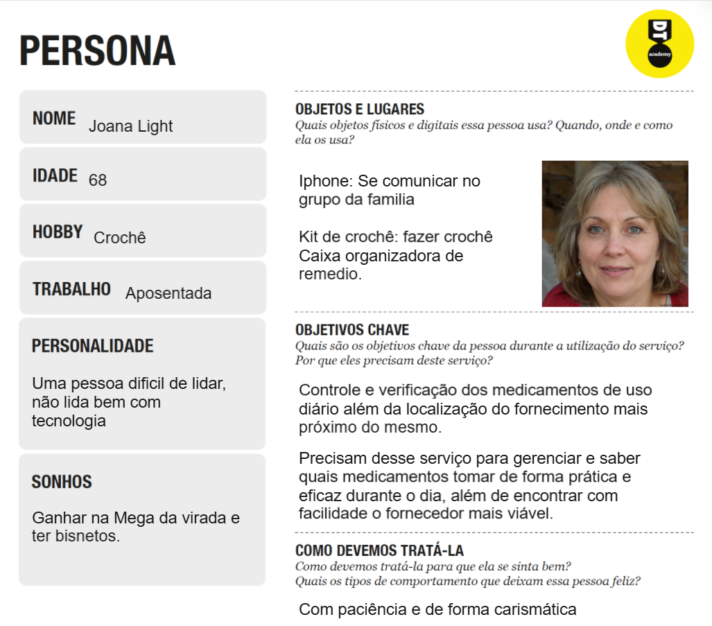
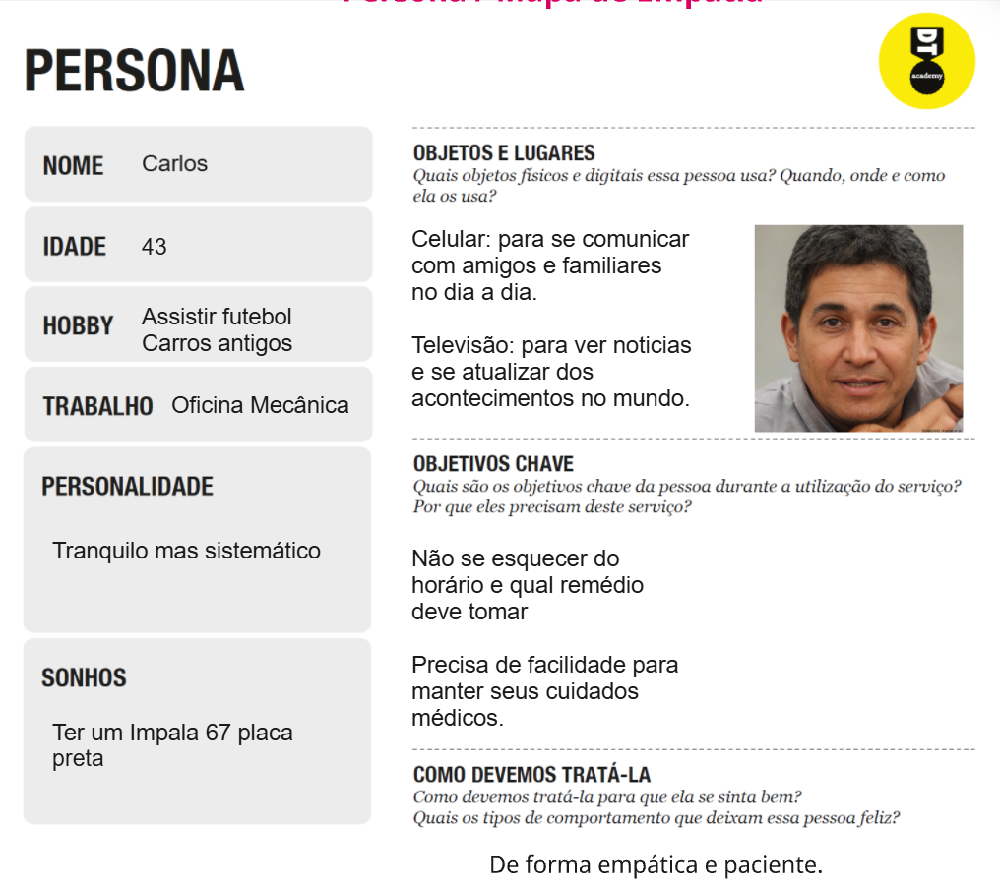

# Product Design

Nesse momento, vamos transformar os insights e validações obtidos em soluções tangíveis e utilizáveis. Essa fase envolve a definição de uma proposta de valor, detalhando a prioridade de cada ideia e a consequente criação de wireframes, mockups e protótipos de alta fidelidade, que detalham a interface e a experiência do usuário.

## Histórias de Usuários
Joana - Lembretes de Horários e Doses
Eu como: Depende de lembretes para organizar meus remédios.
Quero: Receber notificações no celular sobre os horários e dosagens dos meus remédios.
Porque/para: Não esquecer de tomar meus medicamentos corretamente e manter meu tratamento em dia.

Joana - Gestão Integrada de Consultas
Eu como: Uma paciente que precisa conciliar o controle de medicamentos com um cronograma de consultas médicas regulares,
Preciso de: Integrar meus agendamentos de consultas no mesmo calendário dos meus remédios, recebendo lembretes para ambos os compromissos.
Para: Ter uma visão unificada e centralizada de toda a minha agenda de saúde, evitando conflitos de horário e garantindo que eu não perca nenhuma consulta de acompanhamento importante.

Joana - Diferenciação Visual de Medicamentos
Eu como: Pessoa que tem dificuldade em diferenciar remédios.
Quero: Visualizar imagens e descrições dos medicamentos no site.
Porque/para: Evitar confusões e tomar sempre o remédio correto.

Joana - Gestão Detalhada de Múltiplos Medicamentos
Eu como: Um paciente que faz uso de múltiplos medicamentos contínuos,
Preciso de: Agendar alarmes personalizados para cada remédio, com a possibilidade de incluir uma foto do medicamento e a dosagem correta.
Para: Garantir que eu tome a medicação certa, na hora e na quantidade exatas, evitando esquecimentos ou confusões que podem prejudicar meu tratamento.
Joana - Busca Urgente de Medicamentos para Terceiros
Eu como: Uma pessoa cuidando de um familiar doente,
Preciso de: Buscar um medicamento específico e ver no mapa quais as farmácias mais próximas que possam ter.
Para: Economizar tempo e evitar o transtorno de ir a vários locais até encontrar o remédio de que preciso com urgência.

Joana - Busca por Especialistas Médicos
Eu como: Um usuário que se mudou recentemente para um novo bairro.
Preciso de: Uma plataforma para buscar especialistas médicos e ler avaliações de outros pacientes.
Para: Encontrar um profissional de saúde confiável de forma rápida e segura.

Carlos - Comparação de Preços
Eu como: um usuário com orçamento limitado que faz uso de medicamentos de forma recorrente,
Preciso de: uma ferramenta que compare e classifique os preços de um mesmo remédio nas farmácias ao meu redor.
Para: conseguir encontrar a opção mais barata facilmente e economizar dinheiro no meu tratamento.

Carlos - Lembrete de Saída (Lembrar de levar os remédios)
Eu como: um profissional que passa o dia fora e precisa tomar remédios no trabalho,
Preciso de: receber uma notificação inteligente ao sair de casa me lembrando de pegar os medicamentos necessários para o dia.
Para: evitar esquecê-los e garantir a continuidade do meu tratamento mesmo com a rotina corrida.

 Carlos - Identificação Visual para Evitar Confusão
Eu como: um paciente polimedicado que se confunde com comprimidos de aparência parecida,
Preciso de: um catálogo digital no aplicativo que mostre fotos, cores e características de cada um dos meus remédios.
Para: poder identificar e diferenciar os medicamentos com segurança, evitando o risco de tomar a pílula errada.

Título: Carlos - Alerta de Estoque Baixo
Eu como: um paciente que realiza um tratamento contínuo e não pode interrompê-lo.
Preciso de: registrar a quantidade de comprimidos que possuo e receber um alerta automático quando a minha caixa de remédios estiver perto de acabar.
Para: ter tempo hábito de planejar a compra de uma nova caixa, sem o risco de ficar sem minha medicação.


## Proposta de Valor

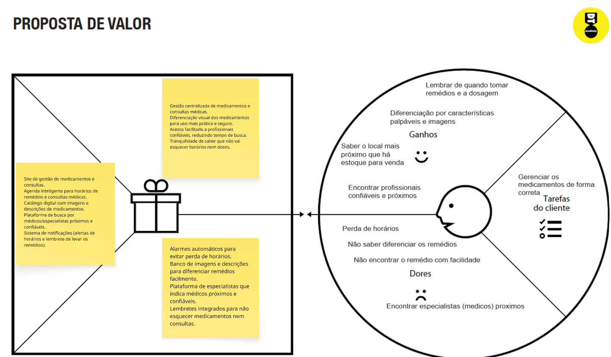
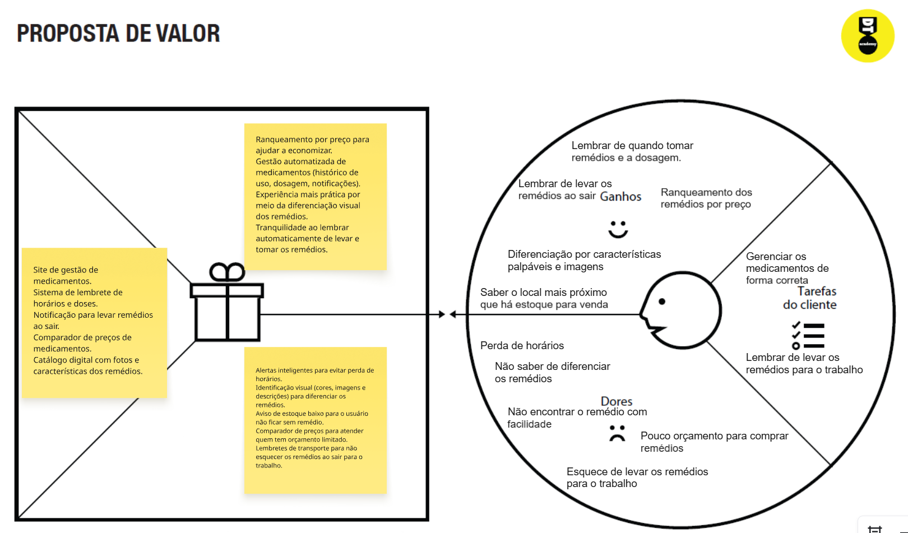


## Requisitos

As tabelas que se seguem apresentam os requisitos funcionais e não funcionais que detalham o escopo do projeto.

### Requisitos Funcionais

| ID     | Descrição do Requisito                                     | Prioridade |
| ------ | ---------------------------------------------------------- | ---------- |
| RF-001 | Notificação visual/sonora para saber horário e dosagem     | Alta       |
| RF-002 | Cadastro,listagem e edição de medicamentos                 | Media      |
| RF-003 | Cadastro,listagem e edição de médicos                      | Media      |
| RF-004 | Busca de medicamentos                                      | Baixa      |
| RF-005 | Lembretes personalizadas                                   | Alta       |
| RF-006 | Filtro de medicamentos de preferencia                      | Baixa      |
| RF-007 | Alerta para quando um remédio cadastrado estiver acabando  | Alta       |
| RF-008 | Sistema para favoritar remédio para facilidade em achar    | Baixa      |
| RF-009 | Login/Cadastro                                             | Alta       |
| RF-010 | Permitir avaliação dos médicos                             | Baixa      |

### Requisitos não Funcionais

| ID      | Descrição do Requisito                                    | Prioridade |
| ------- | --------------------------------------------------------- | ---------- |
| RNF-001 | Site deve estar o tempo todo no AR                        | MÉDIA      |
| RNF-002 | O sistema deve ser responsivo para celular, tablet e PC   | MÉDIA      |
| RNF-003 | Armazenamento que garanta privacidade dos usuários        | MÉDIA      |
| RNF-004 | Desenvolvido utilizando HTML, CSS e JSon                  | MÉDIA      |
| RNF-005 | Ser publicado em um ambiente acessível na Internet        | MÉDIA      |
| RNF-006 | O site deve ter usabilidade intuitiva                     | MÉDIA      |
| RNF-007 | Deve permitir atualização sem perca de dados              | MÉDIA      |


## Projeto de Interface

Artefatos relacionados com a interface e a interacão do usuário na proposta de solução.

### Wireframes

Estes são os protótipos de telas do sistema.

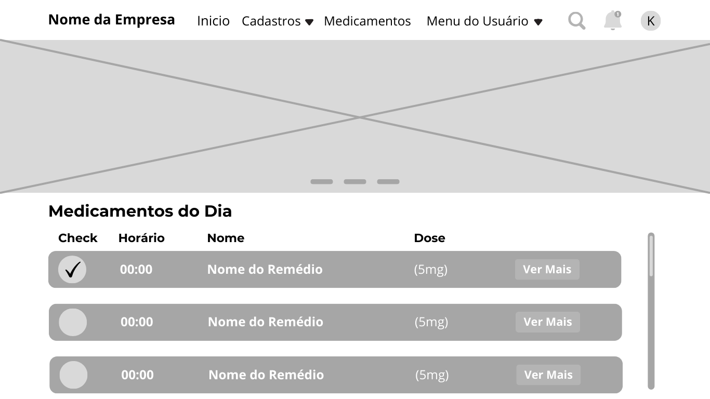
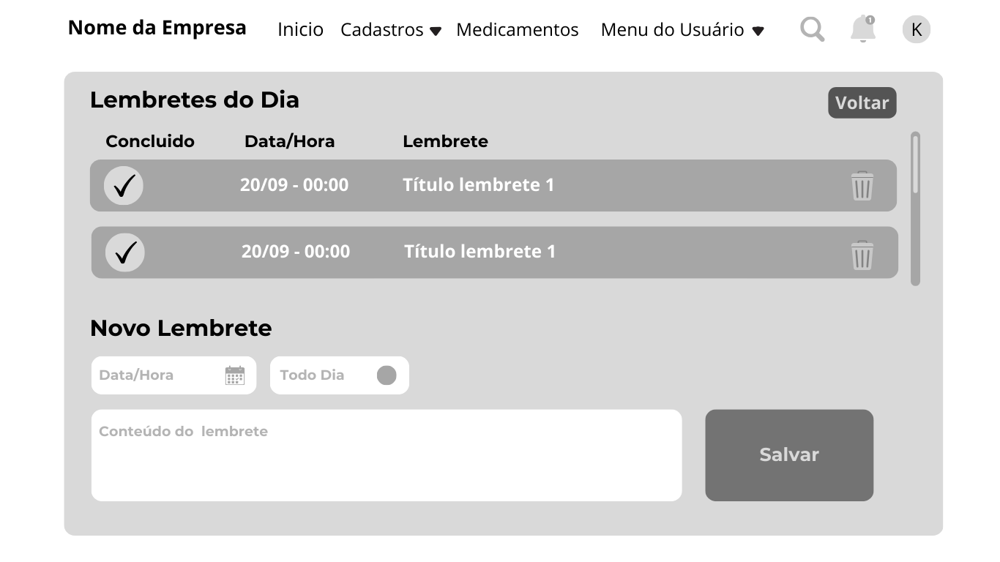
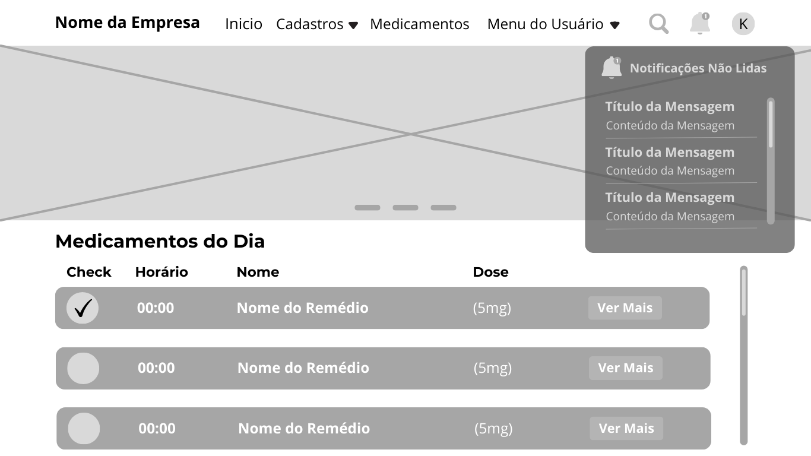
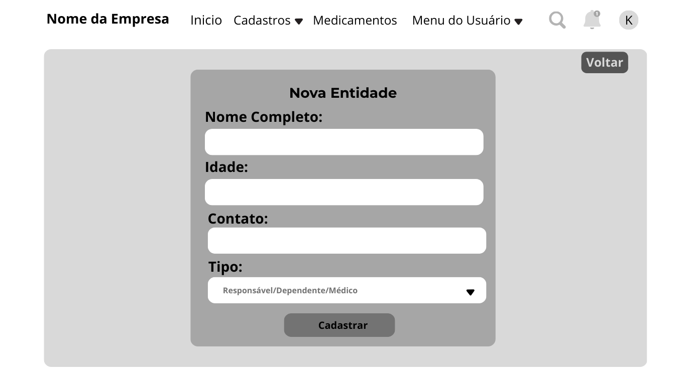
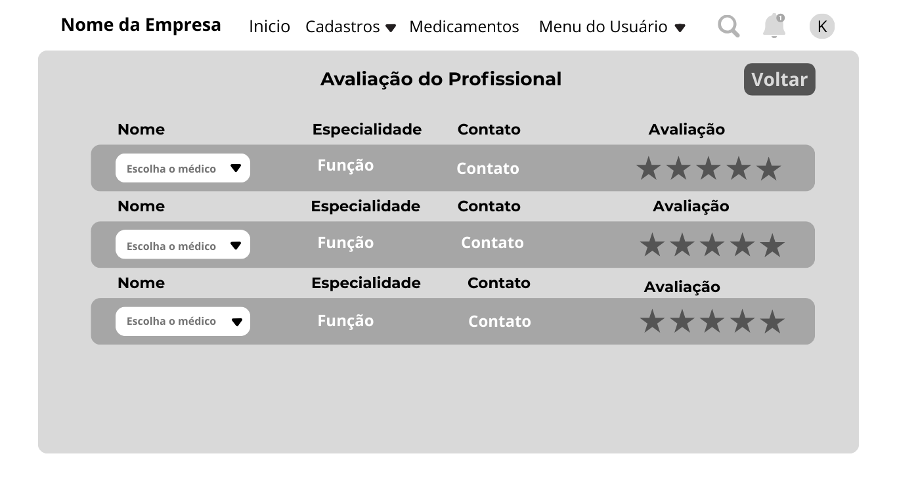
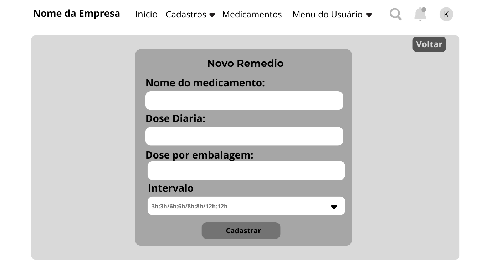
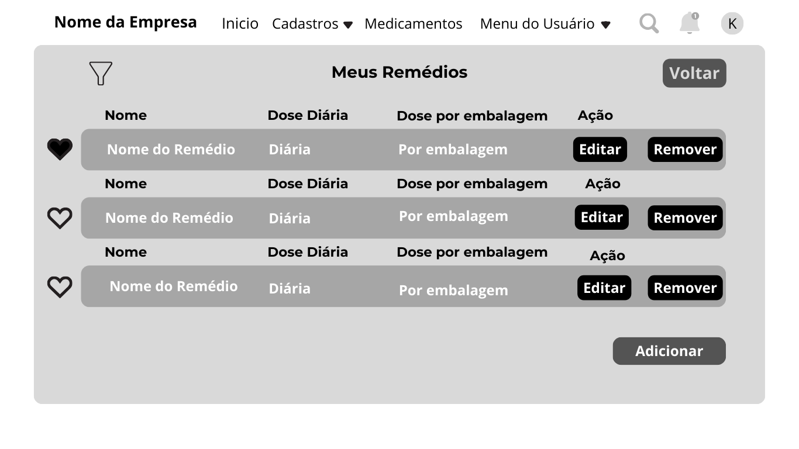
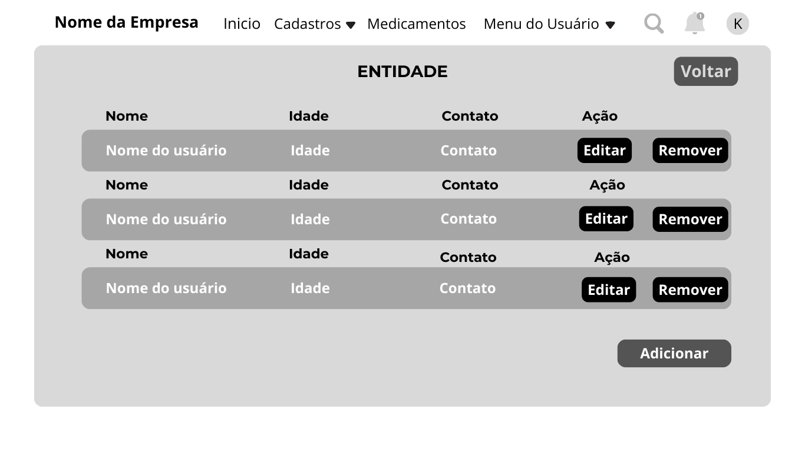
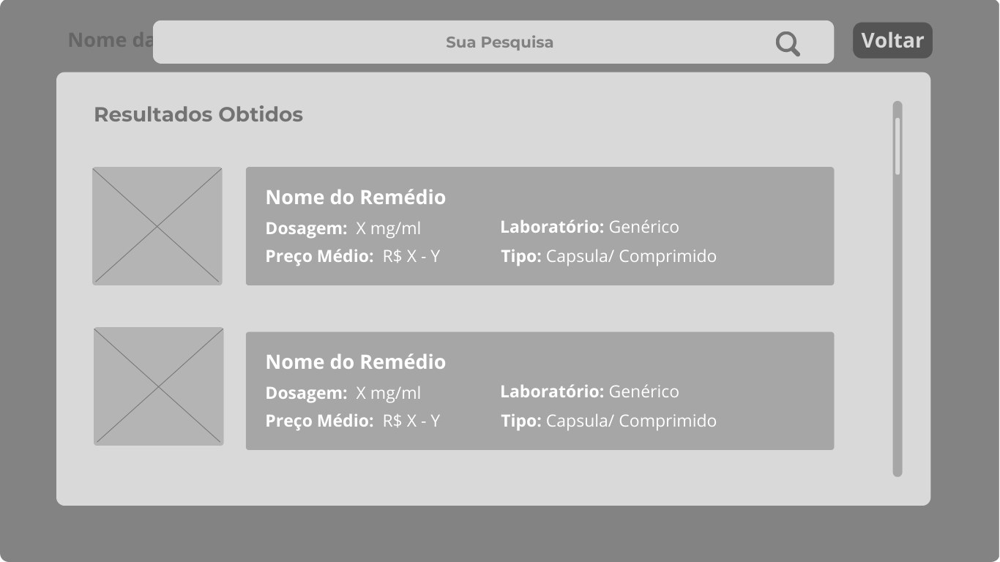

### User Flow


### Protótipo Interativo

[Prototipo Interativo](https://www.figma.com/design/9vAScLPPNvRJOHgSjFIglA/Prot%C3%B3tipo-interativo?node-id=1-249&t=yJJNLRsgRAvY8vq2-1)

# Metodologia
Divisão de papéis: 

Kaio e Thiago- Ptojeto de Interface. 

Savyo e Gabriel- Documentação.

Francielle- Slide.


## Ferramentas

Relação de ferramentas empregadas pelo grupo durante o projeto.

| Ambiente                    | Plataforma | Link de acesso                                 |
| --------------------------- | ---------- | ---------------------------------------------- |
| Processo de Design Thinking | Miro       | https://miro.com/XXXXXXX ⚠️ EXEMPLO ⚠️        |
| Repositório de código       | GitHub     | https://github.com/XXXXXXX ⚠️ EXEMPLO ⚠️      |
| Hospedagem do site          | Render     | https://site.render.com/XXXXXXX ⚠️ EXEMPLO ⚠️ |
| Protótipo Interativo        | MarvelApp  | https://marvelapp.com/XXXXXXX ⚠️ EXEMPLO ⚠️   |
|                             |            |                                                |

> ⚠️ **APAGUE ESSA PARTE ANTES DE ENTREGAR SEU TRABALHO**
>
> Liste as ferramentas empregadas no desenvolvimento do projeto, justificando a escolha delas, sempre que possível. Inclua itens como: (1) Editor de código, (2) )ferramentas de comunicação, (3) )ferramentas de diagramação, (4) )plataformas de hospedagem, entre outras.

## Gerenciamento do Projeto

Divisão de papéis no grupo e apresentação da estrutura da ferramenta de controle de tarefas (Kanban).

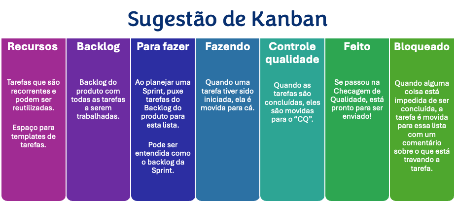

> ⚠️ **APAGUE ESSA PARTE ANTES DE ENTREGAR SEU TRABALHO**
>
> Nesta parte do documento, você deve apresentar  o processo de trabalho baseado nas metodologias ágeis, a divisão de papéis e tarefas, as ferramentas empregadas e como foi realizada a gestão de configuração do projeto via GitHub.
>
> Coloque detalhes sobre o processo de Design Thinking e a implementação do Framework Scrum seguido pelo grupo. O grupo poderá fazer uso de ferramentas on-line para acompanhar o andamento do projeto, a execução das tarefas e o status de desenvolvimento da solução.
>
> **Orientações**:
>
> - [Sobre Projects - GitHub Docs](https://docs.github.com/pt/issues/planning-and-tracking-with-projects/learning-about-projects/about-projects)
> - [Gestão de projetos com GitHub | balta.io](https://balta.io/blog/gestao-de-projetos-com-github)
> - [(460) GitHub Projects - YouTube](https://www.youtube.com/playlist?list=PLiO7XHcmTsldZR93nkTFmmWbCEVF_8F5H)
> - [11 Passos Essenciais para Implantar Scrum no seu Projeto](https://mindmaster.com.br/scrum-11-passos/)
> - [Scrum em 9 minutos](https://www.youtube.com/watch?v=XfvQWnRgxG0)

# Solução Implementada

Esta seção apresenta todos os detalhes da solução criada no projeto.

## Vídeo do Projeto

O vídeo a seguir traz uma apresentação do problema que a equipe está tratando e a proposta de solução. ⚠️ EXEMPLO ⚠️

[](https://www.youtube.com/embed/70gGoFyGeqQ)

> ⚠️ **APAGUE ESSA PARTE ANTES DE ENTREGAR SEU TRABALHO**
>
> O video de apresentação é voltado para que o público externo possa conhecer a solução. O formato é livre, sendo importante que seja apresentado o problema e a solução numa linguagem descomplicada e direta.
>
> Inclua um link para o vídeo do projeto.

## Funcionalidades

Esta seção apresenta as funcionalidades da solução.Info

##### Funcionalidade 1 - Cadastro de Contatos ⚠️ EXEMPLO ⚠️

Permite a inclusão, leitura, alteração e exclusão de contatos para o sistema

* **Estrutura de dados:** [Contatos](#ti_ed_contatos)
* **Instruções de acesso:**
  * Abra o site e efetue o login
  * Acesse o menu principal e escolha a opção Cadastros
  * Em seguida, escolha a opção Contatos
* **Tela da funcionalidade**:


> ⚠️ **APAGUE ESSA PARTE ANTES DE ENTREGAR SEU TRABALHO**
>
> Apresente cada uma das funcionalidades que a aplicação fornece tanto para os usuários quanto aos administradores da solução.
>
> Inclua, para cada funcionalidade, itens como: (1) titulos e descrição da funcionalidade; (2) Estrutura de dados associada; (3) o detalhe sobre as instruções de acesso e uso.

## Estruturas de Dados

Descrição das estruturas de dados utilizadas na solução com exemplos no formato JSON.Info

##### Estrutura de Dados - Contatos   ⚠️ EXEMPLO ⚠️

Contatos da aplicação

```json
  {
    "id": 1,
    "nome": "Leanne Graham",
    "cidade": "Belo Horizonte",
    "categoria": "amigos",
    "email": "Sincere@april.biz",
    "telefone": "1-770-736-8031",
    "website": "hildegard.org"
  }
  
```

##### Estrutura de Dados - Usuários  ⚠️ EXEMPLO ⚠️

Registro dos usuários do sistema utilizados para login e para o perfil do sistema

```json
  {
    id: "eed55b91-45be-4f2c-81bc-7686135503f9",
    email: "admin@abc.com",
    id: "eed55b91-45be-4f2c-81bc-7686135503f9",
    login: "admin",
    nome: "Administrador do Sistema",
    senha: "123"
  }
```

> ⚠️ **APAGUE ESSA PARTE ANTES DE ENTREGAR SEU TRABALHO**
>
> Apresente as estruturas de dados utilizadas na solução tanto para dados utilizados na essência da aplicação quanto outras estruturas que foram criadas para algum tipo de configuração
>
> Nomeie a estrutura, coloque uma descrição sucinta e apresente um exemplo em formato JSON.
>
> **Orientações:**
>
> * [JSON Introduction](https://www.w3schools.com/js/js_json_intro.asp)
> * [Trabalhando com JSON - Aprendendo desenvolvimento web | MDN](https://developer.mozilla.org/pt-BR/docs/Learn/JavaScript/Objects/JSON)

## Módulos e APIs

Esta seção apresenta os módulos e APIs utilizados na solução

**Images**:

* Unsplash - [https://unsplash.com/](https://unsplash.com/) ⚠️ EXEMPLO ⚠️

**Fonts:**

* Icons Font Face - [https://fontawesome.com/](https://fontawesome.com/) ⚠️ EXEMPLO ⚠️

**Scripts:**

* jQuery - [http://www.jquery.com/](http://www.jquery.com/) ⚠️ EXEMPLO ⚠️
* Bootstrap 4 - [http://getbootstrap.com/](http://getbootstrap.com/) ⚠️ EXEMPLO ⚠️

> ⚠️ **APAGUE ESSA PARTE ANTES DE ENTREGAR SEU TRABALHO**
>
> Apresente os módulos e APIs utilizados no desenvolvimento da solução. Inclua itens como: (1) Frameworks, bibliotecas, módulos, etc. utilizados no desenvolvimento da solução; (2) APIs utilizadas para acesso a dados, serviços, etc.

# Referências

SILVA, Anderson Lourenço da; RIBEIRO, Andréia Queiroz; KLEIN, Carlos Henrique; ACURCIO, Francisco de Assis. Cadernos de Saúde Pública, Rio de Janeiro, v. 28, n. 6, p. 1033–1045, jun. 2012. Disponível em: https://www.scielo.br/j/csp/a/pDL9xpBNsSgqFfFBGPPYZhH/?format=html&lang=pt

> **Orientações**:
>
> - [Formato ABNT](https://www.normastecnicas.com/abnt/trabalhos-academicos/referencias/)
> - [Referências Bibliográficas da ABNT](https://comunidade.rockcontent.com/referencia-bibliografica-abnt/)
